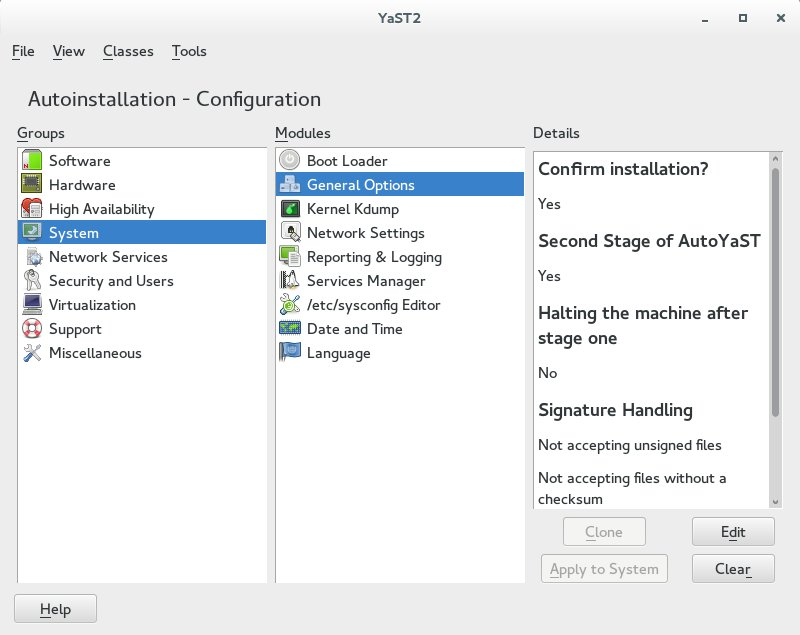

# AutoYaST Development

## Introduction

Each YaST module can be supported by AutoYaST by adapting/adding the following
two files and RPM dependencies:

* [Desktop file](https://github.com/yast/yast-yast2/blob/master/doc/desktop_file.md)

    This file is located in the <YaST module name\>/src/desktop directory.
  
    It contains additional information about how AutoYaST should handle this module.
    E.g. if an entry will be created when the AutoYaST configuration file will be generated (system clone).

* AutoYaST control file <YaST module name\>_auto.rb

    This file is located in <YaST module name\>/src/<YaST module name\>_auto.rb and will be used in following cases:

    * AutoYaST installation workflow.

        AutoYaST will call all *_auto.rb files in the Installation Second Stage.
        AutoYaST reads all module setting from the AutoYaST configuration file, initialize the module and writes the settings to the system.

    * AutoYaST configuration interface

        AutoYaST has an own module with which the user can configure an installation workflow. For that the <YaST module name\>_auto.rb is needed for.

* The RPM *Supplements* autoyast(...) describes which package supports a defined AutoYaST section.

     E.G. the Supplements *autoyast(host,networking)* of the package *yast2-network* says that this package is needed for handling these
     two sections while an installation.

## AutoYaST Control File <YaST module name\>_auto.rb

The interface of <YaST module name\>_auto.rb is similar to the proposal structure and consists of functions that can be accessed using arguments.

Currently there are two implementation ways. For newer AutoYaST control files we are preferring a <YaST module name\>_auto.rb file which is based on the *::Installation::AutoClient* class (second suggestion).

The return values are in both cases the same.

### AutoYaST Control Files Old Style

 The <module name\>_auto.rb client accepts 2 arguments:

* Function

* Configuration Data 

The following functions are needed to make any module work in AutoYaST:

* *Import*:

    Import existing data into the module, usually done only once at the beginning.

* *Summary*:

    To provide a brief summary of the configuration. Calls <Module\>::Summary()

* *Reset*:

    Resets the configuration. It returns empty values but it also can return default values, depending on the module.

* *Change*:

    This function starts the widget sequence.

    Returns: *:ok*, *:next*, *:abort*,...

* *Write*:

    Writes the configuration without displaying any widgets and pop-ups and without restarting any services etc. Calls <Module\>::Write (and sets <Module\>::write_only true)

* *Export*:

    Returns the current configuration. Calls <Module\>::Export

    E.G.: In order to generate following AutoYaST configuration file entry:

        <ssh_import>
          <import config:type="boolean">true</import>
          <copy_config config:type="boolean">true</copy_config>
          <device>/dev/sda4</device>
        </ssh_import>


    this function has to return:

        {"import" => true, "copy_config" => true, "device" => "/dev/sda4"}

  

* *GetModified*:

    Returns true if the current settings have been changed and have to be written to system.

* *Packages*:

    Returns a hash with two key/value pairs. First key is *install* which has a list as the value. The list contains packages that are needed for the service configured by the module to work. This can be a static list of packages or a dynamic list depending on the configuration. The second key is *remove* which contains packages that should be removed to avoid conflicts with other packages. the packages in *remove* are normally determined dynamically, depending on the configuration.

    The function can either return a hash directly or it can call a module function \<Module\>::AutoPackages().

    For example, the function can return the following structure:

        {"install"=> ["pkg1", "pkg2"], "remove" => ["pkg3"]}


The following example shows *nfs_auto.rb*:


```ruby
# YaST namespace
module Yast
  # Client for autoinstallation
  class NfsAutoClient < Client
    def main
      Yast.import "UI"
      textdomain "nfs"

      Builtins.y2milestone("----------------------------------------")
      Builtins.y2milestone("Nfs auto started")

      Yast.import "Nfs"
      Yast.import "Wizard"
      Yast.include self, "nfs/ui.rb"

      @ret = nil
      @func = ""
      @param = {}

      # Check arguments
      if Ops.greater_than(Builtins.size(WFM.Args), 0) &&
          Ops.is_string?(WFM.Args(0))
        @func = Convert.to_string(WFM.Args(0))
        if Ops.greater_than(Builtins.size(WFM.Args), 1) &&
            Ops.is_map?(WFM.Args(1))
          @param = Convert.convert(
            WFM.Args(1),
            :from => "any",
            :to   => "map <string, any>"
          )
        end
        if Ops.greater_than(Builtins.size(WFM.Args), 1) &&
            Ops.is_list?(WFM.Args(1))
          Builtins.y2warning(
            "Old-style configuration detected (got list, expected map). " \
              "<nfs> section needs to be converted to match up-to-date schema"
          )
        end
      end
      Builtins.y2debug("func=%1", @func)
      Builtins.y2debug("param=%1", @param)

      # Create a  summary
      if @func == "Import"
        @ret = Nfs.Import(@param)
      # Create a  summary
      elsif @func == "Summary"
        @ret = Nfs.Summary
      # Reset configuration
      elsif @func == "Reset"
        Nfs.Import({})
        @ret = {}
      # Change configuration (run AutoSequence)
      elsif @func == "Change"
        Wizard.CreateDialog
        Wizard.SetDesktopIcon("nfs")
        @ret = FstabDialog()
        UI.CloseDialog
      elsif @func == "GetModified"
        @ret = Nfs.GetModified
      elsif @func == "SetModified"
        Nfs.SetModified
      # Return actual state
      elsif @func == "Packages"
        @ret = Nfs.AutoPackages
      # Return actual state
      elsif @func == "Export"
        @ret = Nfs.Export
      elsif @func == "Read"
        @ret = Nfs.Read
      # Write given settings
      elsif @func == "Write"
        Yast.import "Progress"
        @progress_orig = Progress.set(false)
        @ret = Nfs.WriteOnly
        Progress.set(@progress_orig)
      else
        Builtins.y2error("Unknown function: %1", @func)
        @ret = false
      end

      Builtins.y2debug("ret=%1", @ret)
      Builtins.y2milestone("Nfs auto finished")
      Builtins.y2milestone("----------------------------------------")

      deep_copy(@ret)

      # EOF
    end
  end
end

Yast::NfsAutoClient.new.main
```

### AutoYaST Control Files Based On [*::Installation::AutoClient* Class](http://www.rubydoc.info/github/yast/yast-yast2/master/Installation/AutoClient)

Much more comfortable would be to use the [*Installation::AutoClient* class](http://www.rubydoc.info/github/yast/yast-yast2/master/Installation/AutoClient).

Here is an example of the *bootloader* module:

```ruby
require "yast"

require "installation/auto_client"
require "bootloader/bootloader_factory"
require "bootloader/autoyast_converter"
require "bootloader/main_dialog"

Yast.import "Bootloader"
Yast.import "BootStorage"
Yast.import "Initrd"
Yast.import "Progress"
Yast.import "PackagesProposal"

module Bootloader
  # Autoyast client for bootloader
  class AutoClient < ::Installation::AutoClient
    class << self
      attr_accessor :changed
    end

    def run
      progress_orig = Yast::Progress.set(false)
      ret = super
      Yast::Progress.set(progress_orig)

      ret
    end

    def import(data)
      Yast::Bootloader.Import(data)

      Yast::PackagesProposal.AddResolvables("yast2-bootloader",
        :package, BootloaderFactory.current.packages)

      true
    end

    def summary
      formatted_summary = Yast::Bootloader.Summary.map { |l| "<LI>#{l}</LI>" }

      "<UL>" + formatted_summary.join("\n") + "</UL>"
    end

    def modified?
      self.class.changed
    end

    def modified
      self.class.changed = true
    end

    def reset
      Yast::Bootloader.Reset
    end

    def change
      ::Bootloader::MainDialog.new.run_auto
    end

    # Return configuration data
    #
    # Some of the sections are useless as they're ignored during import.
    # (for example, entries are generated by Grub2 itself).
    #
    # More details can be found in the original pull request at
    # https://github.com/yast/yast-bootloader/pull/272
    #
    # return map or list
    def export
      Yast::Bootloader.Export
    end

    def write
      Yast::Bootloader.Write
    end

    def read
      Yast::Initrd.Read
      Yast::Bootloader.Read
    end
  end
end
```

### Conventions For AutoYaST Control File writers

#### Exported Data

* Type of exported data:

    Modules should only export data which is normally selected or entered by the user in normal module operation. No computed or automatically probed data should be exported.

* Use Name-spaces

    Exported variables should have a unique name when possible and when general terminology is being used. To avoid conflicts and confusion, use a name space identifier with common words. For example, if a module should export the variable name options, it is better to export <module name\>.options to avoid confusion with other modules using options, which is very common in configurations.

* Lower case variables

    To have a common and unified look of the control file, please use lower case variables when exporting the configuration data.

* The structure of the exported data should be readable and not unnecessary complex.

* Avoid using configuration data as the key in a hash key/value pair. The key of the pair must always contain the variable name, rather than it's contents.

#### Module behavior

The configuration system is the machine where the control file is being created.

In configuration mode for auto-installation, modules should not:

* Read any data from the configuration system.

* Probe or detect hardware on the configuration system.

* Change configuration data on the configuration system.

* Offer a link to other modules (i.e. calling the NIS module from the users module).

* Check if a needed package is installed on the configuration system.

## Desktop Configuration File

When AutoYaST is invoked, it checks for the desktop files in */usr/share/applications/YaST2* and evaluates them to later include them in the AutoYaST configuration Interface. AutoYaST uses the same configuration file used for the YaST2 Control Center with some additional enhancements.

The following is an example of the configuration file for the NIS module:


```ruby
[Desktop Entry]
Type=Application
Categories=Qt;X-SuSE-YaST;X-SuSE-YaST-Net_advanced;

X-KDE-ModuleType=Library
X-KDE-RootOnly=true
X-KDE-HasReadOnlyMode=true
X-KDE-Library=yast2
X-SuSE-YaST-Call=nis

X-SuSE-YaST-Group=Net_advanced
X-SuSE-YaST-Argument=
X-SuSE-YaST-RootOnly=true
X-SuSE-YaST-AutoInst=all
X-SuSE-YaST-Geometry=
X-SuSE-YaST-SortKey=
X-SuSE-YaST-AutoInstClonable=true
X-SuSE-YaST-AutoLogResource=true

Icon=nis_client
Exec=/sbin/yast2 nis

Name=NIS Client
GenericName=Configure NIS client
```

In addition to the keywords from the last example, AutoYaST also evaluates the following keywords:

* X-SuSE-YaST-AutoInst - Is the module compatible with the AutoYaST and can Import/Export configurations?

    Values

    * *all*: Full auto-installation support, including the AutoYaST configuration interface and writing configurations during auto installation.

    * *write*: Write only support. No integration into AutoYaST configuration interface.

    * *configure*: Configuration only support. Normally used only with parts related to installation like partitioning and general options which have no run-time module with support auto-installation. Data is written using the common installation process and modules available in YaST2.

     
* X-SuSE-YaST-AutoInstPath - Path in the control file

    Values

    * *configure* or *install*: All run-time configuration modules are contained in the configure resource. Only configuration data directly touching the installation of a system are contained in the install resource.


* X-SuSE-YaST-AutoInstClient - Name of the client to call

    Values

    * Name of the client to be called by AutoYaST

    * Default Value

        <module name\>_auto

* X-SuSE-YaST-AutoInstDataType - Data type of configuration section

    Values

    * map or list

    * Default Value

        map

     
* X-SuSE-YaST-AutoInstResource - Name of the resource in the Profile

    Values

    * string

    * Default Value

        (empty)


* X-SuSE-YaST-AutoInstRequires - What modules are required before this module is run.

    Values

    * comma delimited list of required modules

    * Default Value

        (empty list)

* X-SuSE-YaST-AutoInstMerge - Multiple sections in the profile can be handled by one module

    Values

    * comma delimited list of sections to merge (see also X-SuSE-YaST-AutoInstMergeTypes)

        The Users module for example handles also groups and user_defaults.

    * Default Value

        (empty)

     
* X-SuSE-YaST-AutoInstMergeTypes - Which datatypes are the section of that will be merged to be handled by one module

    Values

    * comma delimited list of datatypes (list or map) for the sections from X-SuSE-YaST-AutoInstMerge

    * Default Value

        (empty)


* X-SuSE-YaST-AutoInstClonable - is this module able to clone the actual system

    Values

    * boolean (true,false)

        If this is true, the module will appear in the list of modules you can choose from during the cloning of the actual system. Your module will Read() and Export() it's data from the actual system then.

    * Default Value

        false


* X-SuSE-YaST-AutoInstSchema - base name of schema file, including the rnc extension (Relax NG compact syntax)

    Values

    * string

    * Default Value

        (empty)


* X-SuSE-YaST-AutoInstOptional - is the element optional in the schema

    Values

    * boolean (true,false)

        Does this element has to appear in the profile? Unless you have a very basic module, this is always true.

    * Default Value

        true
     

* X-SuSE-YaST-AutoLogResource - is the resource of your module allowed to be logged (since SLES10SP1/10.2)

    Values

    * boolean (true,false)

        Do you allow autoyast to log the data of your resource into the logfile? The default is true but if you have sensible data like passwords, you might want to set this to false. That can always be overridden by Y2DEBUG=1

    * Default Value

        true


## AutoYaST Configuration Interface



The AutoYaST Configuration Module uses the AutoYaST Control File and Desktop Configuration File described above.

So all the dialogs will be handled by AutoYaST to simplify the interface and to provide a common user interface for all modules appearing in the Autoyast Configuration Module.

AutoYaST Configuration Module has the following components:

* **Details** Area:

      Contains a summary of the configuration with the values if available. If values where not configured, the phrase 'Not configured yet' is used, which is available from the summary module. (function *summary* in <module name\>_auto.rb)

* **Edit** Button:

      A button which starts the module UI. (function *change* in <module name\>_auto.rb)

      </img>
  During starting the module you have to provide valid default entries as you can edit entries which are
  completely independent from the running system. One possibility would be to call the *read*
  function in <module name\>_auto.rb during module initialization.

* **Clear** Button:

      A button for resetting the configuration data. This will delete only data in the running module. (function *reset* in <module name\>_auto.rb)

* **Clone** Button:

      A button which reads the setting from installed system. (function *read* in <module name\>_auto.rb)

* **Apply** to System Button:

      A button which writes the settings to the installed system. (function *write* in <module name\>_auto.rb)