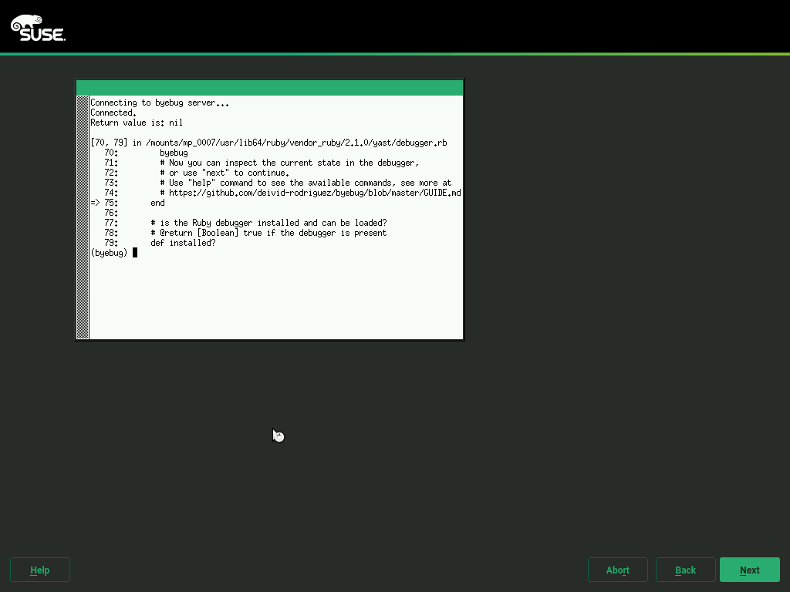
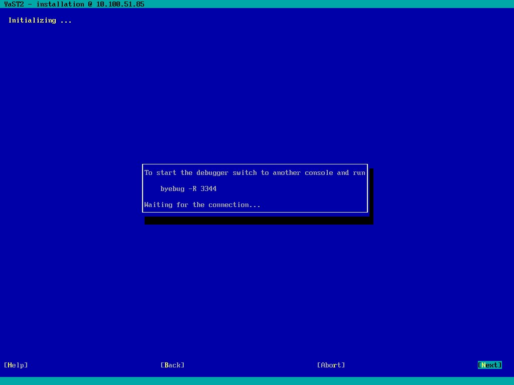
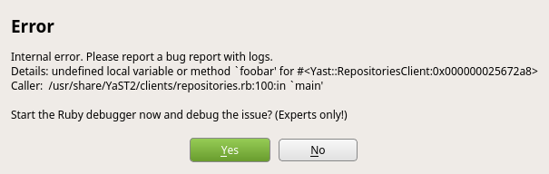
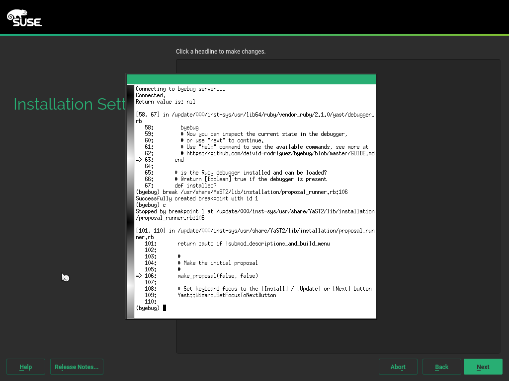

# Debugging YaST

YaST is written in many programming languages. That means you will need a
specific debugger for each language. In theory you could use `gdb` for
debugging any language but for interpreted ones it would be really
difficult.

## Debugging Ruby Code

<a name="installation"></a>For debugging Ruby code you need to install the Ruby
debugger - [byebug Ruby gem](https://github.com/deivid-rodriguez/byebug).

The package is not installed by default, you can install it by this command:

```
sudo zypper in 'rubygem(byebug)'
```

If the package is not available in your repositories you can install it from
[YaST:Head](https://download.opensuse.org/repositories/YaST:/Head/) or
[devel:languages:ruby:extensions](
https://download.opensuse.org/repositories/devel:/languages:/ruby:/extensions/)
repositories.

## Starting the Debugger in Installed System

Make sure the Ruby debugger is installed in the system, see the [installation
instructions](#installation) above.

### <a name="debugger_shortcut"> Using a Keyboard Shortcut

Package `yast2-ruby-bindings-3.2.2` (and newer) include a keyboard shortcut
for starting the debugger directly from running YaST. Simply press the
`Shift`+`Ctrl`+`Alt`+`D` keyboard combination in the Qt UI and the Ruby debugger
will be started automatically. The text mode (Ncurses UI) is currently not
supported, use the other solution below.

### Starting the Debugger Automatically

Recent YaST versions (see [the supported systems](#supported_systems) below)
have built in support for starting the debugger automatically. Simply run

```
Y2DEBUGGER=1 yast2 <client>
```

and the debugger will be started automatically.


*Warning: The debugger port (3344) is accessible to anyone on the
local machine and byebug does not use any sort of authentication. That means it
is a potential security issue, enable the debugger only if you really need it!*


### Starting the Debugger Manually from YaST

You can start the debugger manually in any Ruby code. Just `require` the Ruby
debugger and start it.

The disadvantage is that you need to touch the code and modify the YaST files.
The advantage is that you can start the debugger at the specific place where you
need to debug the code.

#### Graphical Mode

If you run YaST in graphical mode then just add this code snippet at the place
where you want to start the debugger:

```ruby
require "byebug"
byebug
```

The debugger session will be started at the console from which the YaST module
has been started (therefore do not run it from the YaST control center but
manually from a terminal window).

#### Text Mode

Starting the debugger in YaST running in text mode is more complicated because
the debugger front-end cannot be displayed at the same console where the ncurses
UI is running.

The workaround is to use "remote" debugging and run the debugger front-end
at a different console. Add this snippet at the place where you want to start
the debugger.

```ruby
require "byebug"
require "byebug/core"
Byebug.wait_connection = true
# change the port if 3344 is already used
Byebug.start_server("localhost", 3344)
byebug
```

Then start the YaST module and connect to the debugger from a different console
using the `byebug -R 3344` command.


 *Warning: The debugger port (3344) is accessible to anyone on the
local machine and byebug does not use any sort of authentication. That means it
is a potential security issue, use this feature with caution!*

</img>
Note: For a real remote debugging replace `localhost` by
`0.0.0.0`, the debugger will be accessible from the network (if not blocked
by the firewall). Then run `byebug -R <host>:3344` from another machine to
connect to the debugger.


*Warning: In this case anyone from the network who connects to the
debugger port effectively becomes the `root` user!*


## Starting the Debugger in Installation

Starting the debugger during installation is more difficult than in installed
system. You cannot easily install packages or edit the source files as the root
file system is located in a read only RAM disk image.

Fortunately YaST has integrated support for running the debugger in the
installer.

### Using a Keyboard Shortcut

The latest systems include support for starting the debugger directly
after pressing the `Shift`+`Ctrl`+`Alt`+`D` keyboard combination.
See [more details](#debugger_shortcut) in the section above.

#### <a name="debugger_shortcut_systems"></a> Supported Systems

- openSUSE Tumbleweed 20161117 or newer

### Using the Integrated Debugger

#### <a name="supported_systems"></a> Supported Systems

- openSUSE Tumbleweed 20160602 or newer
- openSUSE Leap 42.2 or newer
- SUSE Linux Enterprise Server/Desktop 12 SP2 or newer


#### Enabling the Debugger

To enable the integrated debugger boot the installation with `Y2DEBUGGER=1` boot
option.

In graphical mode the debugger console is automatically opened and you can
trace the installation there.



In text mode you need to manually switch to another virtual console and run
the debugger manually.



If you cannot switch to another console (e.g. you are installing over a serial
line) then you can use remote debugging, see below.


#### Remote debugging

There are two possibilities how to run a remote debugging:

- SSH installation:
  - Boot the installation with `Y2DEBUGGER=1 SSH=1`
  - Connect from a remote machine, if you use a graphical installation then
    the debugger should appear in a separate window just like in a standard
    installation.  
  - In text mode you need to start additional SSH connection to the
    installation system and run the debugger session manually, follow the
    instructions displayed by the installer.

- Run the debugger front-end on a different machine. Use this option if for
  whatever reason you cannot run a SSH installation.  

  
  *Warning: In this case anyone from the network who connects to the
  debugger port first can watch or modify the installation. This is a security
  risk, use this option only in a trusted network!*
  - Boot the installation with `Y2DEBUGGER=remote`, the debugger will be
  accessible from the network.
  - You need the `byebug` Ruby gem installed on the machine where you connect
    from, see the [installation instructions](#installation) at the beginning.
  - The installer will print the command (in format `byebug -R <ip>:<port>`)
    which you need to run.

### Generic Crash Handler

When YaST crashes in Ruby code and the Ruby debugger is installed in the system
then the error pop up additionally asks for starting the debugger:



After confirming the debugger a debugging session is started.

This crash handler is available also in the installer.

### Using byebug

Here is just a basic description of byebug, you should read the full [byebug
documentation](https://github.com/deivid-rodriguez/byebug/blob/master/GUIDE.md)
to get more details.

#### Basic Usage

Byebug provides a [REPL (Read-Eval-Print Loop)](
https://en.wikipedia.org/wiki/Read%E2%80%93eval%E2%80%93print_loop), here is
just an overview of the basic commands:

Command   | Shortcut | Description
:-------- | :------- | :----------
next      | n        | execute the next line
step      | s        | step into a block or a method
break     |          | set a breakpoint
finish    |          | start execution until end of the current frame
continue  | c        | continue executing the code until a break point or the optional line number argument is reached
backtrace | bt       | print the backtrace

Use the `help` command to list all available commands.

If you enter any input which is not recognized as a byebug command it will
be evaluated as a Ruby code. This way you can easily inspect the current state
or execute any Ruby code interactively.

If your Ruby code conflicts with a byebug command use `eval` command to
run the code evaluation explicitly. For more complex input use the `irb`
command which starts an
[IRB](https://en.wikipedia.org/wiki/Interactive_Ruby_Shell) session.

#### Debugging Hints

##### Debugging Workflow

Unlike GDB which can be attached to any running process the Ruby debugger cannot
stop the running Ruby code and inspect it. Then means you have to start the
debugger in advance, you cannot start it later from outside.

Therefore you need to trace the code step by step or add enough breakpoints
to be sure that the execution stops when you need.



##### Breakpoints

Breakpoints cannot be added at any source code line, only to the stopping points.
Use `info file` command to list the stopping points. See [more details](
https://github.com/deivid-rodriguez/byebug/blob/master/GUIDE.md#lines-you-can-stop-at
) in the documentation.
