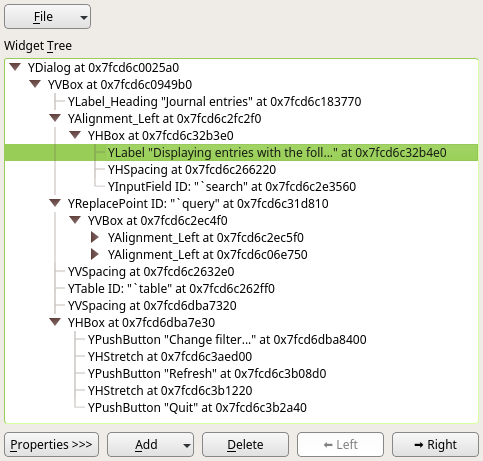

# The UI Inspector

Since libyui-3.2.7 the UI includes a simple dialog editor. (The older versions
contain only the inspector with read-only access, without the editing abilities.)

You can invoke it in a running YaST module by `Ctrl` + `Shift` + `Alt` + `Y`
key combination in the graphical (Qt) UI. You will see a pop up dialog with
the current widget tree, something like this:

You can select a widget in the tree and the respective widget will be highlighted
in the YaST dialog.

### Modifying a Widget

- Select the widget in the widget tree
- Display the properties, click the `Properties >>>` button
- Double click the property
- Set the new value in the pop up dialog

This way you can change the displayed label, enabled/disabled status and some
layout properties.

*Note: Some properties are read-only and cannot be changed, more over only simple data
values can be modified, the structured data (displayed as `???`) cannot be changed.*

### Removing a Widget

- Select the widget in the widget tree
- Press `Delete` button

*Note: If a container widget is removed all its child widgets are removed too!*

### Moving a Widget

- Select the widget in the widget tree
- Press `Up/Down` or `Left/Right` buttons to move it to the requested place.
- If you need to move the widget further you need to select it in the widget
tree again (this should be fixed in the future)

*Note: Moving widgets between containers is not possible, widgets can be moved
only inside their (direct) parent container. If you need to move it elsewhere
you have to delete it and create a new widget at the requested container.*

### Adding a New Widget

- Select the parent container widget which will contain the new added widget
(usually a `HBox`/`VBox`)
- Press `Add` button, in the menu select the requested widget type
- Edit the widget label in the displayed pop up (only for visible widgets)
- Some widgets ask for more data (e.g. the table header)
- The new widget is added at the end of the container, if you need to place
it before some widgets use the `Up/Down` or `Left/Right` buttons to move it to
the correct place.

### The Limitations

- The UI inspector works only in the graphical (Qt) UI, the text mode is not
supported.
- The changes in UI are not permanent, the changed dialog cannot be exported
or dumped to a file. After closing the dialog all changes are lost.
- Currently you can only make a screenshot or dump the widget tree to the y2log
(`Ctrl`+`Shift`+`Alt`+`T`). But this still can help designers to easily propose
changes in the UI and allows quick prototyping.
- Widgets can be moved only inside their (direct) parent container.
- Some special widgets (e.g. `TimezoneSelector`) cannot be added yet, but all
basic widgets work.
- Removing `Wizard` buttons (_Next, Back, Help,..._) does not work properly and
should not be used (should be disabled in the future).

### Demo

Here is a short demo which shows some editing possibilities in the YaST Journal
module.

### TO DO

- Export the displayed dialog to a file so the user changes are not lost (this
is probably the most important missing feature)
- Support adding more widgets
- Better handle some corner cases (removing Wizard buttons, removing whole dialog,...)
- Keep the selection after moving the widget
- Text mode support (a bit tricky, the inspector dialog will cover the displayed
  dialog, find a solution to this)
- Allow creating a new dialog from scratch
